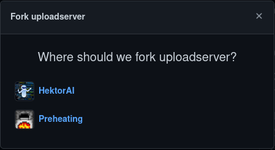
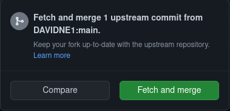
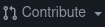

# Contributing

Since this is an opensource project, you are allowed to contribute.

 

## Forking the repository

Click the "fork" button and chose where to fork the repository.

 

&emsp;&emsp;&emsp;&ensp;↓
 

 

## Making changes

You can work on your forked repository like you would on any other repository. If the upstream (the main repository) has newer changes than you, you can simply click "fetch upstream" and select "Fetch and merge" in github to fetch and merge these changes.

 

&emsp;&emsp;&emsp;&emsp;&ensp;↓
 

 

## Opening pull requests

If you're finished implementing a feature and are confident sharing this code with the rest of the world you can click "Contribute" and select "Open pull request". This will create a new pull request in the main repository. The owners may look at your code and if its worth merging they will accept this pull request.

 

&emsp;&emsp;&emsp;&nbsp;↓
 

 

## Final words
Its great if you decide to contribute to opensource but don't forget that you should keep your code readable and use language specific conventions.